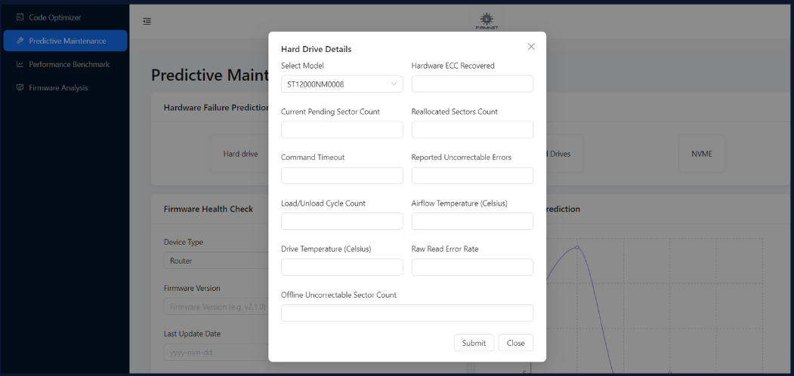
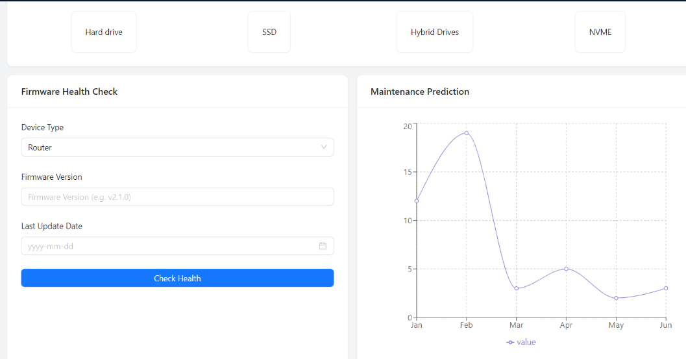
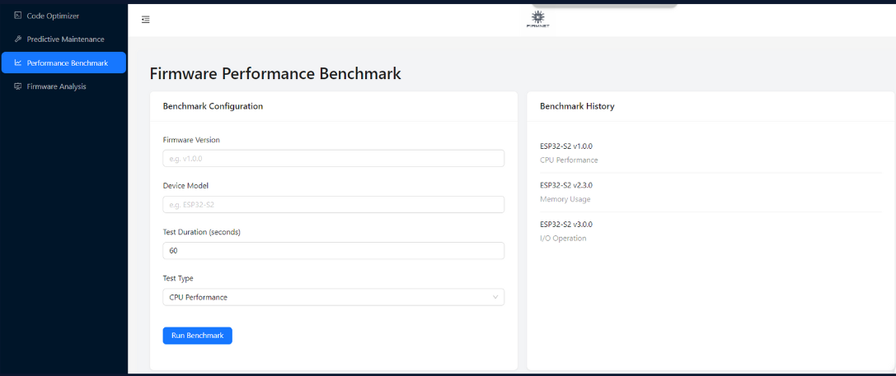
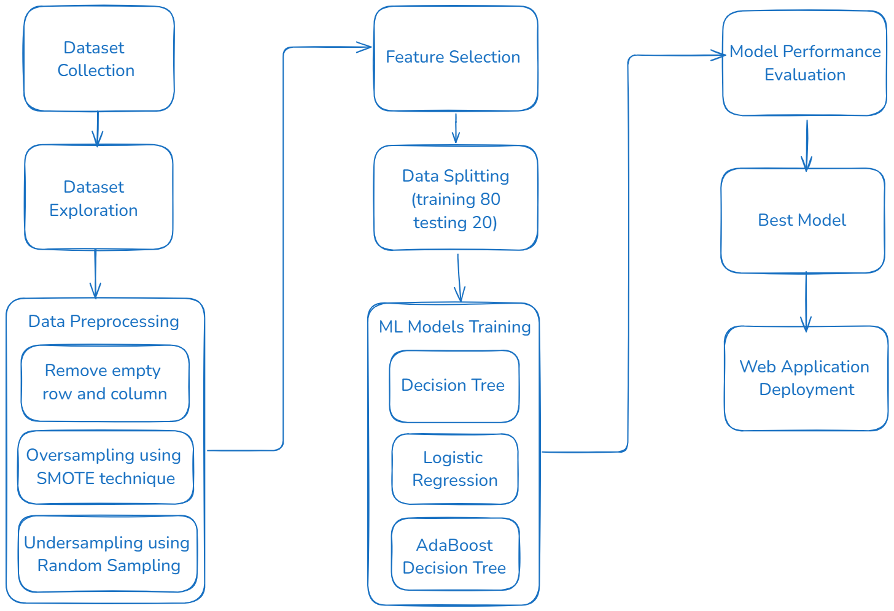
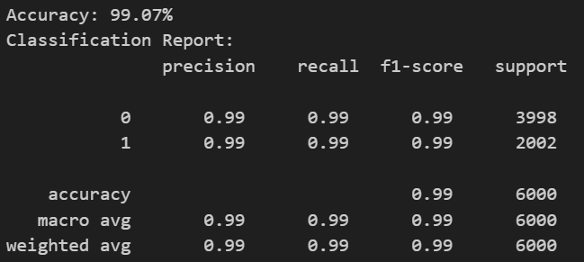
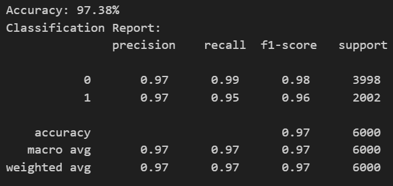
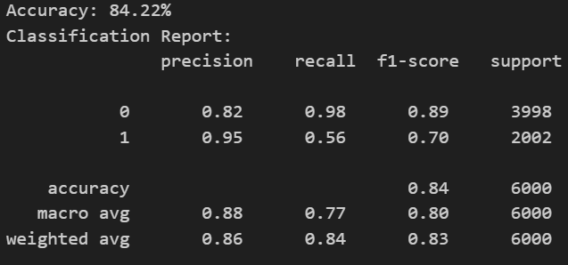
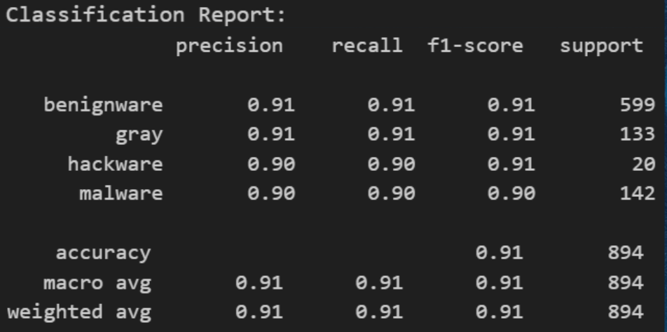
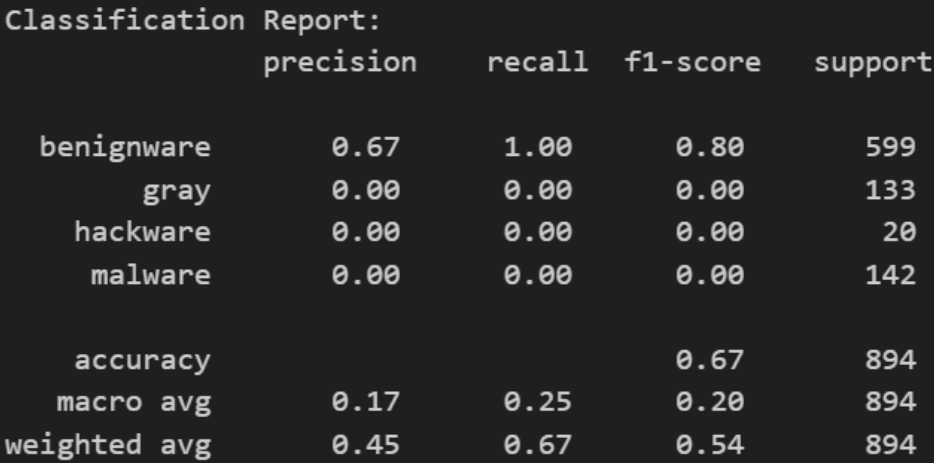

# Western Digital x MUMTEC-36H-Hackathon 2024-

# Team Orca – MUMTEC Hackathon 2024 Submission

## Project Title: FirmNet

### Table of Contents

1. [Project Overview](#project-overview)
2. [Technologies Used](#technologies-used)
3. [Installation and Setup](#installation-and-setup)
4. [Usage](#usage)
5. [Features](#features)
6. [Architecture](#architecture)

(feel free to add any content or sections)

---

### Project Overview

Firmware is essential for hardware devices, as it provides the necessary low-level control for their operations. However, traditional firmware development often encounters issues related to security, maintenance, and performance optimization. FirmNet addresses these challenges by offering an AI-powered platform that revolutionizes firmware development through code optimization, predictive maintenance, and performance benchmarking. The platform includes two AI models integrated into its front: a firmware analysis model based on deep learning using the MobileNetV2 architecture, which has achieved a 91.95% accuracy, and a hardware predictive model using Decision Tree Classifier that forecasts hard drive failure based on SMART attributes, with an accuracy of 99.07%. These models allow for efficient daily monitoring and enhanced firmware performance, significantly improving the overall reliability and optimization of firmware systems.

- **Problem Statement**: Traditional firmware development is prone to vulnerabilities, exposing devices to security breaches and attacks. Manual inspection of firmware code is time-consuming and prone to human error, leading to overlooked bugs or inefficiencies. Furthermore, optimizing firmware for performance is a complex task that often results in suboptimal functionality due to inefficient resource utilization.

- **Proposed Solution**: FirmNet, an AI-powered platform for firmware development, offers an innovative solution to the challenges of firmware security, manual inspection, and performance optimization by integrating advanced AI models. Key features of FirmNet include automated firmware analysis to detect vulnerabilities and inefficiencies, AI-driven predictions of hardware failures to proactively address potential issues, and intelligent performance optimization to enhance resource utilization. By automating these processes, FirmNet significantly reduces the time and effort required for manual code inspection, minimizes the risk of human error, and ensures that firmware is secure, efficient, and reliable.

---

### Technologies Used

[Programming languages]

- Python 3.7
- JavaScript
- React
- Html
- TailWindCSS

[Libraries]

- Pandas
- NumPy
- Tensorflow
- Matplotlib
- Pillow
- Sklearn
- Keras
- Ant Design

[Tools]

- VSCode
- Neovim

[Model Developed]

- MobileNetV2
- EfficientNetB0
- Logistic Regression
- Decision Tree Classifier
- AdaBoost Decision Tree Classifier

### Installation and Setup

To install the project, run the following command in your terminal:

```
git clone git@github.com:Renee1306/firmware-development.git
```

Change the directory to the project using the following command:

```
cd firmware-development
```

Install yarn using the following command:

```
npm install yarn -g
```

Install the project dependencies using the following command:

```
yarn install
cd backend
pip install -r requirements.txt
```

Run the project using the following command:

```
yarn run dev
```

Run the backend server using the following command:

```
python app.py
```

---

### Usage






---

### Features

### 1. Firmware Analysis

When a user uploads a firmware file (such as a .bin or .elf), the system will classify it as benignware, malware, hackware, or unknown. Following this classification, the system will carry out firmware analysis to extract information regarding the file's format, architecture, metadata, and other relevant details.

### 2. Hardware Failure Prediction

The user can select the hardware type from a dedicated tab. For example, within the hard drive tab, there are multiple companies and models available for selection. After choosing a specific company and model, the user can input the SMART attribute data, and the system will predict whether the hard drive is at risk of failure or not. Additionally, this function can be scheduled to scan the operational data daily to monitor if the hard drive has failed. Currently, the system only supports one hard drive model, but future updates will incorporate more models as well as other types of hardware.

---

### Architecture

### 1. Harddrive Failure Prediction



#### Dataset Collected

This model aims to predict hard drive failure by analyzing SMART (Self-Monitoring and Reporting Technology) attributes, which are regularly collected during standard hard drive operations. These SMART attributes provide daily diagnostics, including metrics like read/write error rates, spin retry counts, power cycle counts, and more. We utilized publicly available data from Backblaze, a company that began tracking the SMART statistics of around 47,000 hard drives in their data center. Due to computational limitations, only data from the second quarter of 2024, which is the latest dataset was used for this analysis. The dataset is downloaded in zip file, and it contains all the operational data of all models from 2024-04-01 to 2024-06-30.
Dataset Link: https://www.backblaze.com/

#### Data Exploration

Several data exploration steps were done in order to learn about the data for further preprocessing. Based on the data exploration, we have decided to focus on a single model, ST12000NM0008, due to its balanced number of successes and failures. Given the large number of models across various companies, this approach helps streamline the current analysis. However, in the future, we plan to expand the solution to include additional models.

#### Data Preprocessing

- Data Cleaning: For data cleaning, all rows and columns containing missing or empty data were removed from the dataset.

- Data Balancing: After data preprocessing, the dataset contains 1545937 success count and 105 failure count. The RandomUnderSampler is applied with sampling_strategy={0: 20000}, which reduces the majority class (success) to 20,000 samples, and SMOTE is then applied with sampling_strategy={1: 10000} to oversample the minority class (failure) to 10,000 samples, addressing the data imbalance issue. Both steps use random_state=42 to ensure consistent results across runs.

#### Feature Selection

The correlation matrix is computed, which shows the relationships between all features and the target variable 'failure.' The top 10 highest correlation variable is selected as the features to train the model.

#### Data Splitting

The dataset is split into 80% of training data and 20% of testing data for further model training.

#### Model Training

- Decision Tree Classifier: A Decision Tree Classifier is trained using its default parameters, with random_state=42 ensuring that the tree’s behavior, such as feature selection and node splitting, is consistent during each run. The default settings, like using Gini impurity (criterion='gini') for split quality and no specified maximum depth, allow the tree to grow until all leaves are pure or have fewer than 2 samples.
- AdaBoost Decision Tree Classifier: AdaBoostClassifier is created with a specified base_estimator (e.g., a Decision Tree) and set to use 100 estimators (n_estimators=100). AdaBoost improves performance by combining weak learners, with each one focusing on correcting the errors of the previous one. The random_state=42 ensures reproducibility across different runs.
- Logistic Regression: The logistic regression model is instantiated using the LogisticRegression() function from the sklearn library. The random_state=42 parameter ensures that the results are reproducible by setting a fixed seed for the random number generator, making it possible to replicate the model’s behavior across different runs.

#### Model Performance Evaluation

Among the three models evaluated, the Decision Tree Classifier delivered the strongest performance, achieving an accuracy of 99.07%, along with precision, recall, and F1-score values of 0.99 each. Hence, Decision Tree Classifier is saved for deployment in our solution.

- Decision Tree Classifier




- AdaBoost Decision Tree Classifier



- Logistic Regression



### 2. Firmware Prediction


#### Dataset Collected

This model is designed to predict the condition of firmware using image data. The images are represented in a CSV file, which contains the filename, class label (in both categorical and numerical formats), and the first 1024 bytes of data. These bytes are converted into a grayscale range of 0-255 by first converting each byte to its decimal value (0-15) and then scaling it accordingly. The firmware dataset includes the first 1024 bytes from malicious, benign, and compromised Internet of Things (IoT) and embedded software binaries, specifically in the Executable and Linkable Format (ELF). There are total of four classes which are benignware, hackware, malware and unknown.
Dataset Link: https://www.kaggle.com/datasets/datamunge/iot-firmware-image-classification

#### Data Exploration

Several data exploration steps were conducted to better understand the dataset in preparation for preprocessing. Based on the findings, the dataset consists of the following categories: 'benignware' with 2,999 instances, 'gray' with 669 instances, 'hackware' with 103 instances, and 'malware' with 711 instances.

#### Data Preprocessing

Data preprocessing involved both data cleaning and balancing, utilizing a weighted method to ensure equitable distribution across classes.

#### Data Splitting

The dataset is split into 80% of training data and 20% of testing data for further model training.

#### Model Training

- MobileV2Net: This model utilizes MobileNet pre-trained on ImageNet (excluding the top layer) with an input shape of (224, 224, 3). A GlobalAveragePooling2D layer reduces dimensionality, followed by a Dense layer with 1024 units and ReLU activation, and a final Dense layer with softmax activation for multi-class classification, based on the number of classes in train_generator.num_classes. The MobileNet layers are frozen during initial training, and the model is compiled with the Adam optimizer (learning rate of 0.001), categorical crossentropy loss, and accuracy as the performance metric. The model is trained for 10 epochs with validation using the test data.
- EfficientNetB0: This model utilizes EfficientNet as the base (excluding the top layer) with an input shape matching the pre-trained model. A GlobalAveragePooling2D layer reduces dimensionality, followed by a Dense layer with 1024 units and ReLU activation. The final Dense layer with softmax activation predicts 4 classes. The EfficientNet base layers are used without further training, and the custom layers are compiled for training.


#### Model Performance Evaluation

Among the 2 models evaluated, the MobileV2Net delivered the stronger performance, achieving an accuracy of 91.95%, compared to EfficientNetB0 with accuracy of 67.00%.
- MobileV2Net


- EfficientNetB0


---
